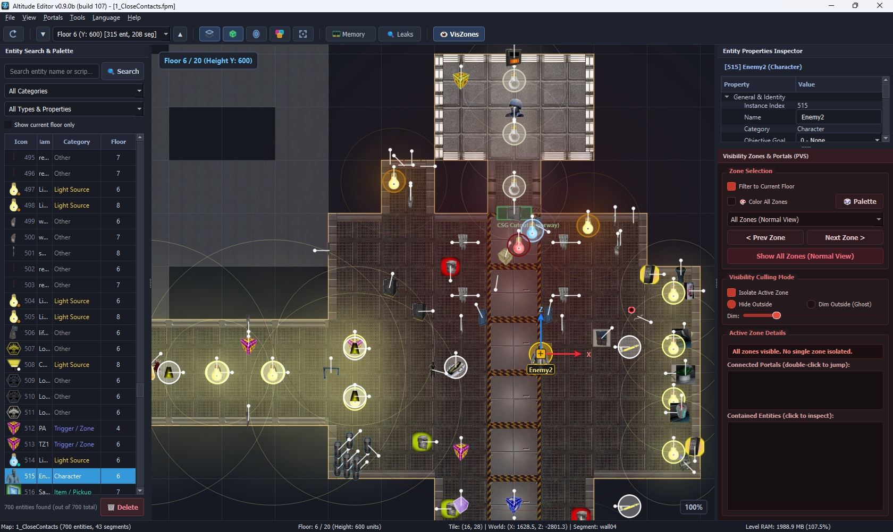
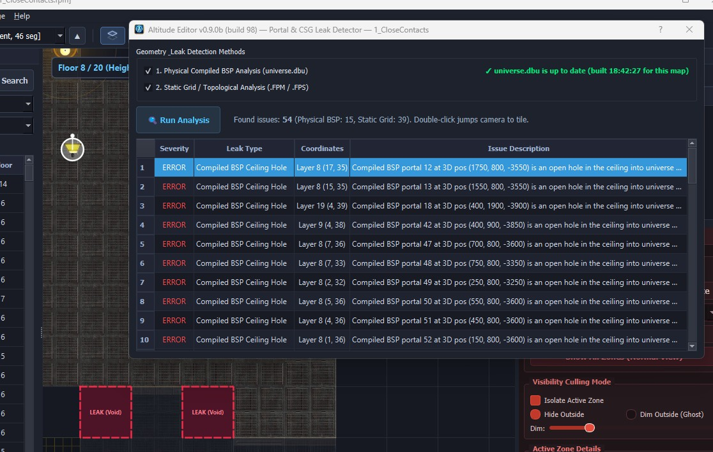
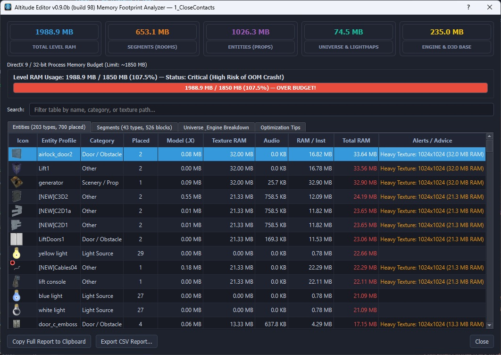
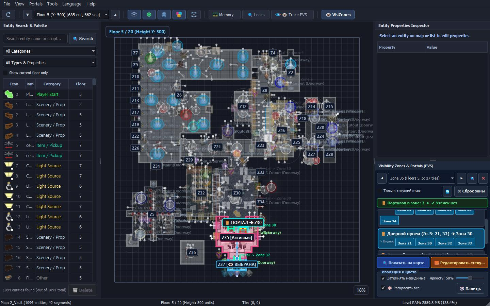

<div align="center">


# Altitude Editor

**High-speed 2D inspection, diagnostic, and editing tool for FPS Creator maps**

[](https://www.qt.io/)
[](https://en.cppreference.com/)
[](https://microsoft.com/windows)
[](LICENSE)

**Lead Developer:** Ivan Klenov (aka NavY LiK)  
**Studio:** Madness Studio  

</div>

---

## 📌 Overview

**Altitude Editor** is designed primarily as a fast, lightweight **inspection and editing tool**, rather than a full-fledged replacement for the original FPS Creator 3D editor.

It provides streamlined, high-speed **2D navigation** (Doom/Build-style floorplan) that allows you to view FPS Creator levels with layer-by-layer floor switching, visual display of segments and entities, along with focused tools for editing and optimizing your maps.

<p align="center">
  
</p>

---

## 🌟 Core Highlights & Tools

### 1. 🚪 Portal Leak Detector
Level geometry issues can easily disrupt the **PVS portal generation** performed by the FPS Creator compiler, resulting in visual glitches, hall-of-mirrors effects, or broken visibility culling. The Leak Detector automatically scans geometry for bad segments and holes between segments:

* **Two Diagnostic Modes**:
  * **Logical Analysis**: Examines the raw segment structure, boundaries, and bitfields directly from `.fpm` / `.fps` files.
  * **Physical Analysis**: Reads the compiled universe (`universe.dbu`) after a test run in FPS Creator to verify actual BSP portals in 3D world space.
* **Smart Heuristics**: Pinpoints open ceiling/floor gaps into the void, inverted exterior walls facing outside, disconnected zones, and coplanar overlapping faces.
* **Originating Zone Attribution**: Automatically traces exterior leaks (such as missing ceiling slabs on roof layers or perimeter wall breaches) to the interior room/zone they leaked from, eliminating ambiguous unassigned errors.
* **Interactive Zone Filtering**: Isolate warnings by specific Vis Zones (`Filter by Vis Zone`) with dynamic per-room issue counters (`Zone X — N issues`).
* **Live On-Canvas Hazard Markers**: Real-time animated hazard frames directly on the 2D grid for the active floor (red dashed `⚠️` for leaks/errors, amber `⚡` for clashes and warnings).
* **Instant Reticle Navigation**: Selecting any error in the list instantly centers the camera on the fault tile with precision corner reticles (`[ ]`).

<p align="center">
  
</p>

---

### 2. 🧱 Segment Inspector & Conflict Resolver (`Ctrl+E`)
Directly inspect, edit, and repair segment tiles on the 2D grid without needing to switch back and forth to the heavy 3D editor:

* **Interactive 4-Wall Configuration Widget**: Checkboxes for North, East, South, and West walls with mathematical bi-directional auto-tiling presets (*All 4 Walls*, *U-Shape*, *Corner*, *Opposite*, *Single Divider*, *Open Interior*, *Clear Tile*).
* **Segment Bank Switcher & Filter**: Instant search filter (`🔍 Filter...`) to swap segment meshes and textures on the fly with scrollable, constrained dropdown popups.
* **Floor & Ceiling Flags**: Configure `mapground` modes (Standard Room Floor, Interior 2, Roof / Ceiling Slab, Exterior Ground) and toggle `mapsymbol` hole/void flags.
* **1-Click Double-Wall Conflict Resolver**: Automatically detects when adjacent rooms place solid boundary walls on the same shared edge (causing severe in-game Z-fighting flickering and degenerate BSP portal bleeding). Features a dedicated 2D collision diagram and 1-click fixes (`Keep Room A Wall` / `Keep Room B Wall`) that automatically clean the redundant wall, recalculate PVS connectivity, and update the map live.

---

### 3. 📊 RAM Analyzer & Memory Budget Inspector
Due to the 32-bit architecture and DirectX 9 memory management of the classic FPS Creator engine, levels that exceed ~1.85 GB of RAM will crash with Out Of Memory (OOM) errors.

* **Precise Footprint Breakdown**: Asynchronously calculates memory allocations across mesh geometries (`.x`), textures (`.dds`, `.tga`, `.bmp`), sound effects (`.wav`, `.mp3`), segments, and universe data.
* **"Bigger Elephant in the Room"**: Automatically sorts entities and assets by memory consumption, giving you instant clues about which heavy textures or high-poly models you should downscale or optimize first.
* **Engine Limit Gauge**: Visual danger gauge (Safe / Caution / Critical / Over Budget) alerting you before you even launch a build.
* **Exportable Reports**: Generate detailed CSV tables or copy summary diagnostics directly to the clipboard.

<p align="center">
  
</p>

---

### 4. 👁️ Visibility Zone Manager (PVS) & Optical LOS Tracer
Visualizes visibility sectors, generated portals, and doorways, letting you see exactly how the engine divides your map into distinct rooms.

* **PVS Decomposition & Isolation**: Replicates the engine's portal-cutting algorithm to give practical visibility boundaries without 3D compile delays. Isolate active rooms, adjust dimming/opacity for foreign zones, and reveal potential PVS leak paths.
* **Interactive Room Badges (`Z#`)**: Crisp zone labels rendered with drop shadows and dark backdrops on top of all entities, gizmos, and CSG cutouts. High-priority click hit-testing allows selecting rooms directly even when dense entities or lights are clustered in the room center.
* **Straight-Line Optical Raycasting (LOS)**: Accurate line-of-sight rays trace direct visibility through doorways and window portals between adjacent rooms. Ray paths are geometrically clipped strictly to the inner surfaces of rooms (`clipRayToZone`), eliminating misleading zigzags or rays penetrating solid exterior walls.
* **Portal Inspector & Multi-Row Visibility Chips**: Dedicated dock panel listing all door and window portals for the active room with leak indicators (`🚨 Утечка` / `👁 Видно`). Interactive FlowLayout chips wrap cleanly into multiple rows, allowing 1-click inspection, LOS tracing, and jumping directly into visible target zones.
* **PVS Reachability & Culprit Analysis (`ZoneVisibilityDialog`)**: Identify distant rooms rendered through portal cascades and jump directly to the culprit doorway causing unwanted through-wall visibility.
* **Empty Space Deselection**: Left-clicking anywhere in empty space outside of all zones immediately resets zone selection, unhides all rooms, and clears active trace rays.
* **Dichotomy Room Deletion (`Shift+Del`)**: Quickly excise an entire room and re-evaluate surrounding portal topology with a single keystroke.

<p align="center">
  
</p>

---

### 5. 🔍 Instant Entity Search & Palette
The built-in dock panel allows you to quickly locate any placed item across the entire map:
* Search by entity name, category, script (`.fpi`), sound, or custom parameters.
* Filter by the current active floor or view map-wide totals.
* Double-click any entry in the list to immediately snap the viewport to that entity.

---

### 6. 🔄 Smart Reload from Disk (`F5`)
Working on dual monitors? Keep **Altitude Editor** open alongside the official FPS Creator editor. Whenever you save changes in FPS Creator, press **`F5`** in Altitude Editor to instantly reload the map from disk, giving you continuous live feedback on memory budgets, portal integrity, and entity placement.

---

### 7. 💻 Headless Console Mode (CLI)
For build pipelines, batch verification, or automated map diagnostics, `AltitudeEditor-cli.exe` can inspect maps without ever opening a GUI window.
* Automatically validate maps and detect leaks in batch scripts.
* Compute exact memory footprints and produce tabular reports.
* Render and export high-resolution minimap PNGs for documentation or web viewers.

> *Don't know if anybody needs that, but hey, I've already done it! 😬*

---

## 🖥️ Executables Overview

The distribution includes two standalone executables:

| Executable | Type | Description |
| :--- | :--- | :--- |
| **`AltitudeEditor.exe`** | GUI | Interactive visual editor and inspector. Runs without a console window; double-click or associate with `.fpm` files. |
| **`AltitudeEditor-cli.exe`** | CLI | Headless command-line utility for batch auditing, leak testing, memory estimation, and offscreen rendering. |

---

## ⚙️ Command-Line Interface (CLI)

`AltitudeEditor-cli.exe` options and commands:

### General Options
```text
  -h, --help                          Show command reference and usage guide
  -v, --version                       Print application version and build number
```

### Map Auditing & Diagnostics
```text
  --analyze-memory <map.fpm>          Calculate exact level RAM footprint (Segments, Entities, CSG, Lights)
  --check-leaks <map.fpm>             Analyze portals and CSG geometry for leaks and errors
  --dump-floor <map.fpm> <floor>      Print dimensions and block stats for a specific floor
```

### Headless Rendering & Minimap Export
```text
  --export-png <map.fpm> <out.png> [floor] [--color-zones]
                                      Render specified map floor to a high-resolution PNG image
  --snapshot-window <map.fpm> <out.png> [entity_idx] [--size W H] [--color-zones] [--floor N] [--zone Z] [--portal-row R] [--focus-chip C]
                                      Render offscreen editor window snapshot with optional active zone, portal, and chip selection
  --snapshot-memory <map.fpm> <out.png>
                                      Render offscreen memory analyzer dialog snapshot
```

### CLI Usage Examples
```cmd
:: 1. Check version and build
AltitudeEditor-cli.exe --version

:: 2. Analyze memory footprint and 32-bit ceiling status
AltitudeEditor-cli.exe --analyze-memory "Files/mapbank/1.fpm"

:: 3. Run portal and leak checks
AltitudeEditor-cli.exe --check-leaks "Files/mapbank/1.fpm"

:: 4. Render floor 0 to PNG
AltitudeEditor-cli.exe --export-png "Files/mapbank/1.fpm" "minimap_floor0.png" 0
```

---

## ⌨️ Keyboard & Mouse Shortcuts

| Key / Shortcut | Action |
| :--- | :--- |
| **`F5`** | **Smart Reload**: Reload active map from disk |
| **`Ctrl + S`** | **Save Map**: Write changes back to `.fpm` with backup creation |
| **`Ctrl + E`** | **Segment Inspector**: Open Segment Inspector & Conflict Resolver |
| **`Ctrl + T`** | **Trace Visibility**: Trace optical line-of-sight PVS ray from active zone |
| **`Shift + Del`** | **Dichotomy Tool**: Delete selected room/zone and recompute portals |
| **`+`** / **`=`** | Move one floor up (`Floor Up`) |
| **`-`** / **`_`** | Move one floor down (`Floor Down`) |
| **`PageUp`** / **`PageDown`** | Navigate floors sequentially |
| **`Ctrl + Wheel`** / **`Shift + Wheel`** | Cycle floors with mouse wheel |
| **`[`** / **`]`** | Zoom out / Zoom in |
| **`0`** | Reset zoom to 100% |
| **`Home`** | Fit entire level in viewport (`Zoom Fit`) |
| **Left-click on Zone Badge** | **Select Zone**: Highest priority hit-testing over underlying entities |
| **Left-click in Empty Space** | **Deselect Zone**: Reset active zone and restore full-map normal view |
| **Left-click on Entity** | Select entity / Drag with interactive translation gizmo |
| **Right-click on tile** | Context menu: **Inspect & Edit Segment** (`🧱 Inspect & Edit Segment...`) |
| **Right-click / Middle-click Drag** | Pan canvas |
| **`Escape`** | Clear active zone, tile selection, and hazard reticles |

---

## 🛠️ Building from Source

### Prerequisites
* **Operating System**: Windows 7 / 8 / 10 / 11 (32-bit or 64-bit)
* **Qt Toolkit**: Qt 5.15+ (MinGW 32-bit or MSVC 32-bit)
* **C++ Compiler**: MinGW 8.1.0 32-bit (GCC 8.1+) or compatible
* **Build System**: CMake >= 3.16, Ninja

### Build Steps (PowerShell)
```powershell
# 1. Add Qt5 and MinGW to environment PATH:
$env:PATH = "C:\Qt5\5.15.2\mingw81_32\bin;C:\Qt5\Tools\mingw810_32\bin;C:\Qt5\Tools\Ninja;" + $env:PATH

# 2. Enter project directory and create build directory:
mkdir -p "C:\FPSC Maped\build"
cd "C:\FPSC Maped\build"

# 3. Configure with CMake and Ninja:
cmake -G "Ninja" -DCMAKE_BUILD_TYPE=Release -DCMAKE_PREFIX_PATH="C:\Qt5\5.15.2\mingw81_32" ..

# 4. Compile targets (auto-increments build number):
ninja
```

---

## 📚 Technical Documentation

For details on the reverse-engineered FPS Creator binary map formats (`map.fpmb`, `map.ele`, bitfields, and segment containers), refer to:  
👉 **[FPSC_MAP_FORMAT_SPEC.md](FPSC_MAP_FORMAT_SPEC.md)**

---

## 📄 License

This project is licensed under the **MIT License** — see the [LICENSE](LICENSE) file for details.

```text
MIT License

Copyright (c) 2026 Ivan Klenov (aka NavY LiK) / Madness Studio
```
